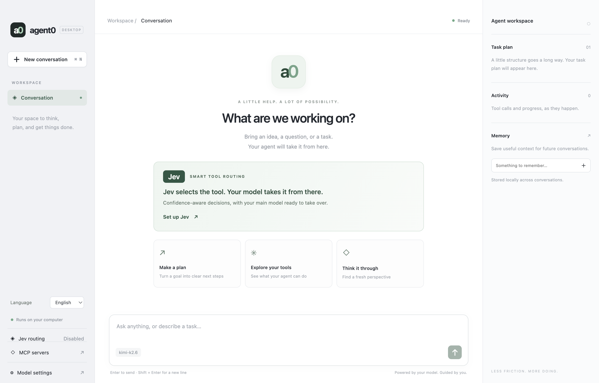

# agent0

**English** | [简体中文](README.zh-CN.md)

A desktop AI agent with **Jev-powered tool routing**, MCP integration, task planning, and persistent memory.

**Jev selects the tool. Your model handles the reasoning.** Enable optional TypeSafe Jev routing to select relevant tools with confidence-based fallback to your main model. Follow each decision, confidence score, and latency in the Activity panel.

[Set up Jev](docs/configuration.md#jev-routing) · [Download desktop builds](https://github.com/xudafeng/agent0/actions/workflows/build-electron.yml)



## Download the desktop app

[**Download Electron builds from GitHub Actions**](https://github.com/xudafeng/agent0/actions/workflows/build-electron.yml?query=branch%3Amain)

Prebuilt downloads include Electron; you do not need Node.js or pnpm to run the app.

1. Sign in to GitHub with an account that has read access to this repository.
2. Open the download link above and choose the latest successful **Build Electron app** run on `main`.
3. Scroll to **Artifacts** and download the build for your computer:

| Your computer | Artifact name | File inside |
| --- | --- | --- |
| macOS, Apple Silicon (M-series) | `agent0-mac-arm64-<commit>` | `agent0-<version>-mac-arm64.zip` |
| macOS, Intel | `agent0-mac-x64-<commit>` | `agent0-<version>-mac-x64.zip` |
| Windows, x64 | `agent0-win-x64-<commit>` | `agent0-<version>-win-x64.exe` |
| Linux, x64 | `agent0-linux-x64-<commit>` | `agent0-<version>-linux-x64.AppImage` |

`<commit>` identifies the source revision and `<version>` is the app version. On a Mac, **Apple menu → About This Mac** shows whether the computer uses an Apple chip or an Intel processor. Windows and Linux ARM builds are not currently provided.

### Install and launch

Extract the downloaded GitHub artifact ZIP first, then follow the steps for your platform:

- **macOS:** Extract the application ZIP inside the artifact, move `agent0.app` to **Applications**, and open it.
- **Windows:** Run the `.exe` installer and follow the installation prompts, then launch **agent0** from the Start menu.
- **Linux:** Give the `.AppImage` file execute permission in your file manager, then open it. Alternatively, run `chmod +x agent0-<version>-linux-x64.AppImage` and `./agent0-<version>-linux-x64.AppImage`, replacing `<version>` with the downloaded version.

These builds are unsigned, and macOS builds are not notarized. Your operating system may show a security prompt or block the initial launch.

On first launch, open **Model settings**, choose Kimi or OpenAI, and enter your model ID and API key. Jev routing is optional and uses a separate TypeSafe API key.

### If downloads are unavailable

Artifacts expire after **14 days**. If a run has no matching artifact, check that its platform build completed successfully and the artifact has not expired. Repository collaborators with permission to run workflows can start a fresh build using **Run workflow** on the [workflow page](https://github.com/xudafeng/agent0/actions/workflows/build-electron.yml), selecting `main`. Otherwise, use a newer successful run or [build from source](#run-from-source).

Downloads are currently distributed through Actions artifacts; this workflow does not publish installers to GitHub Releases. See [GitHub's artifact download guide](https://docs.github.com/en/actions/how-tos/manage-workflow-runs/download-workflow-artifacts) for access requirements.

## Run from source

```bash
pnpm install
pnpm start
```

The app opens a native desktop window. Choose **Model settings**, select Kimi or OpenAI, and enter your model ID and API key. Ask a question or describe a task to begin.

- Press Enter to send, or Shift + Enter for a new line.
- Watch tool activity and the agent's task plan in the workspace panel.
- Save useful context in Memory to reuse across conversations.
- Choose New conversation (Cmd/Ctrl + N) to clear the chat and plan while keeping memory.
- Switch between English and Simplified Chinese using Language in the sidebar or model settings. The interface initially follows your system language and remembers your choice locally. Conversation content stays in its original language.
- Open **MCP servers** in the sidebar to add local stdio or remote HTTP/SSE servers, test connections, inspect tools, and enable or disable integrations. See [MCP configuration](docs/configuration.md#mcp-servers) for setup details.
- Choose **Built-in Filesystem**, select a folder, and save to let the agent read, write, and organize files within that folder. The server is bundled with the app; no separate Node.js installation is required.
- Open **Jev routing** to enable TypeSafe's decision model with your own TypeSafe API key. Jev selects a relevant tool before each main-model step; Activity shows the decision, confidence, and latency. See [Jev configuration](docs/configuration.md#jev-routing).

Model responses appear when each agent run finishes; tool activity updates during the run. The current conversation survives a window reload and stays in memory until you start a new conversation or quit. Saved memory and model settings persist after quitting.

## Build a macOS app

```bash
pnpm package
```

Open `release/mac-arm64/agent0.app` on Apple Silicon (or `release/mac/agent0.app` on Intel). You can copy the app into Applications. This local build is unsigned and is not notarized for distribution.

The packaged app stores settings in `~/Library/Application Support/agent0/.env`, with memory and traces in its `data` directory. Development uses the project's `.env` and `data` directory. API keys are stored locally in plaintext and are never bundled into the app. Requests go to the configured model provider.

The application icon lives in `desktop/assets`. After editing `icon.svg`, run `pnpm build:icons` on macOS to regenerate the PNG and ICNS assets, then run `pnpm package` to rebuild the app.

## GitHub Actions builds

The [**Build Electron app** workflow](.github/workflows/build-electron.yml) runs on branch pushes, `v*` tags, pull requests, and manual dispatch. It uses the pinned pnpm version and resolves dependencies from `package.json` with `pnpm install --no-frozen-lockfile`, then runs typechecking and unit tests before packaging. Lockfiles are ignored, so resolved dependency versions can change between builds.

See [Download the desktop app](#download-the-desktop-app) for artifact names and installation steps. Artifacts are retained for 14 days. No signing secrets or model API keys are needed in CI; users configure their own API keys in the app.

The Apple Silicon build also runs the desktop integration smoke test. Intel macOS is cross-packaged on the same Apple Silicon runner; Windows, Linux, and Intel application launch behavior still needs testing on those systems.

## Command line

```bash
cp .env.example .env
# Fill in your provider settings.
pnpm cli
```

| Command | Description |
| --- | --- |
| `/memory` | Show persistent memory. |
| `/remember <text>` | Save a memory. |
| `/task` | Show the current task plan. |
| `exit` | Quit. |

See [configuration](docs/configuration.md) for provider settings.

## Development

```bash
pnpm typecheck
pnpm test
pnpm build
pnpm test:desktop
pnpm eval
```

The desktop smoke test uses an isolated temporary profile and a local mock model endpoint; it does not use your API keys. Evaluation calls your configured real model.
