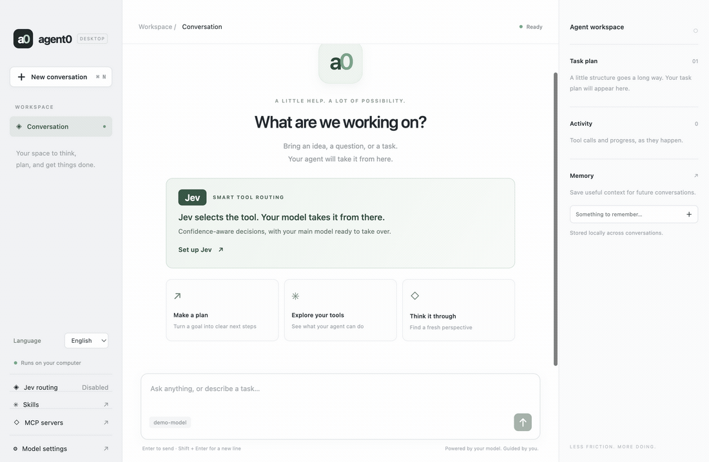

# agent0

[English](README.md) | **简体中文**

一款支持 **Jev 智能工具路由**、MCP 集成、任务规划和持久记忆的桌面 AI 助手。

**Jev 选择工具，主模型负责推理。** 可选启用 TypeSafe Jev，根据置信度选择相关工具，不确定时自动交由主模型处理。在活动面板中查看每次路由的选择结果、置信度和耗时。

[配置 Jev](docs/configuration.md#jev-routing) · [下载桌面应用](https://github.com/xudafeng/agent0/actions/workflows/build-electron.yml)



## 桌面应用

```bash
pnpm install
pnpm start
```

启动后会打开原生桌面窗口。在「模型设置」中选择 Kimi 或 OpenAI，填写模型 ID 和 API 密钥，即可提问或描述任务。

- 按 Enter 发送，Shift + Enter 换行。
- 在工作区面板中查看工具调用和任务计划。
- 将有用的信息保存到「记忆」，供后续对话使用。
- 点击「新对话」（Cmd/Ctrl + N）清空当前对话和计划，保留已保存的记忆。
- 在侧栏或模型设置中切换英文和简体中文。界面首次启动时跟随系统语言，并在本地记住你的选择；对话内容保持原来的语言。
- 在侧栏打开「MCP 服务」，添加本地 stdio 或远程 HTTP/SSE 服务，测试连接、查看工具并启用或停用集成。详见 [MCP 配置](docs/configuration.md#mcp-servers)（英文）。
- 选择「内置文件系统」，选定文件夹并保存，即可让助手读写和整理该文件夹中的文件。服务随应用内置，无需另外安装 Node.js。
- 打开「Jev 智能路由」，使用自己的 TypeSafe API 密钥启用 Jev。每次调用主模型前，Jev 会选择相关工具；活动面板显示选择结果、置信度和耗时。详见 [Jev 配置](docs/configuration.md#jev-routing)（英文）。

模型回复会在每次任务运行完成后显示，工具活动则在运行过程中实时更新。重新加载窗口会保留当前对话，直到你开始新对话或退出应用。已保存的记忆和模型设置在退出后仍会保留。

## 构建 macOS 应用

```bash
pnpm package
```

Apple Silicon 设备打开 `release/mac-arm64/agent0.app`，Intel 设备打开 `release/mac/agent0.app`。可以将应用复制到「应用程序」文件夹。本地构建未签名，也未进行分发公证。

macOS 打包应用将设置保存到 `~/Library/Application Support/agent0/.env`，记忆和运行记录保存在同一目录下的 `data` 文件夹中。开发模式使用项目目录下的 `.env` 和 `data`。API 密钥以明文保存在本地，不会打包进应用；请求发送给所配置的模型服务商。

应用图标位于 `desktop/assets`。修改 `icon.svg` 后，在 macOS 上运行 `pnpm build:icons` 重新生成 PNG 和 ICNS 文件，再运行 `pnpm package` 重新打包。

## GitHub Actions 构建与下载

**Build Electron app** 工作流支持分支推送、`v*` 标签、Pull Request 和手动触发。它使用固定版本的 pnpm，通过 `pnpm install --no-frozen-lockfile` 根据 `package.json` 安装依赖，执行类型检查和单元测试后生成以下产物。锁文件被忽略，因此不同构建使用的具体依赖版本可能变化。

| 平台 | 架构 | 下载产物 |
| --- | --- | --- |
| macOS | Apple Silicon（arm64） | 包含 `agent0.app` 的 ZIP |
| macOS | Intel（x64） | 包含 `agent0.app` 的 ZIP |
| Windows | x64 | NSIS `.exe` 安装包 |
| Linux | x64 | `.AppImage` |

打开 **Actions → Build Electron app → 成功的构建记录 → Artifacts**，下载对应平台的产物。先解压 GitHub 产物压缩包；macOS 用户再解压其中的应用 ZIP，将 `agent0.app` 移到「应用程序」；Linux 用户需先为 AppImage 添加可执行权限，再启动应用。下载产物保留 14 天。

工作流合入默认分支后，可点击 **Run workflow** 手动构建。合并前也可以通过分支推送触发构建。产物未签名，macOS 产物未公证，操作系统可能要求确认后才能打开。CI 不需要签名证书或模型 API 密钥，用户在应用中配置自己的密钥。该工作流上传 Actions 产物，不会发布 GitHub Releases。

Apple Silicon 构建还会运行桌面集成冒烟测试。Intel macOS 版本在同一 Apple Silicon runner 上交叉打包；Windows、Linux 和 Intel macOS 的实际启动行为仍需在对应系统上验证。

## 命令行

```bash
cp .env.example .env
# Fill in your provider settings.
pnpm cli
```

复制后，在 `.env` 中填写模型服务商配置。

| 命令 | 说明 |
| --- | --- |
| `/memory` | 查看持久记忆。 |
| `/remember <text>` | 保存一条记忆。 |
| `/task` | 查看当前任务计划。 |
| `exit` | 退出。 |

模型服务商设置详见[配置文档](docs/configuration.md)（英文）。

## 开发

```bash
pnpm typecheck
pnpm test
pnpm build
pnpm test:desktop
pnpm eval
```

桌面冒烟测试使用隔离的临时配置和本地模拟模型接口，不使用你的 API 密钥。评估命令 `pnpm eval` 会调用你配置的真实模型。
